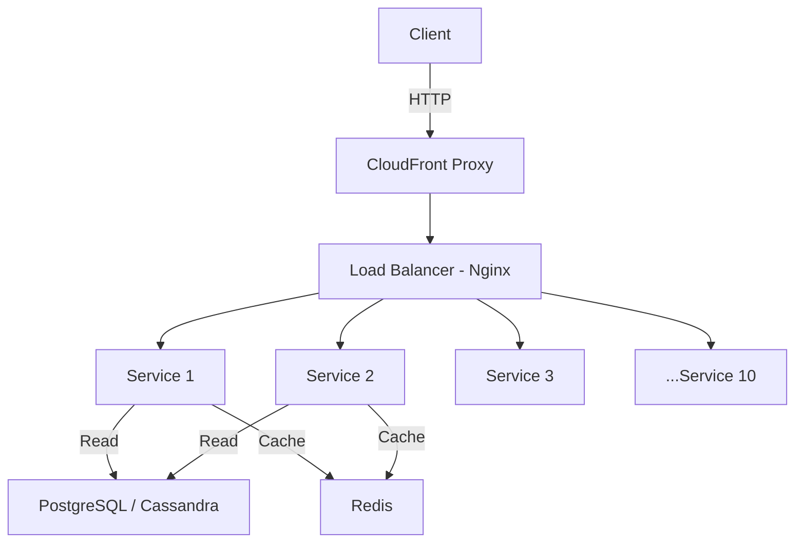

# System Design Capstone – High-Throughput Microservice Performance Testing

A production-scale backend performance testing project focused on scalability, fault tolerance, and query optimization using microservices, caching, and load balancing.

Designed and tested a distributed system capable of handling up to 60,000 requests with near-zero error rate and sub-100ms latency under load.

---

## Overview

This project simulates a real-world service architecture and benchmarks the impact of scaling microservices horizontally with load balancing and caching layers. The system was iteratively optimized for throughput and reliability.

### Technologies and Strategies Used

- PostgreSQL and Cassandra for database performance comparison  
- Redis for caching high-frequency read requests  
- Nginx for load balancing across service instances  
- CloudFront as a simulated proxy/CDN  
- Progressive scaling from 1 to 10 service instances  

---

## Query Performance Benchmarks

| Query Type                     | Avg. Response Time |
|--------------------------------|--------------------|
| Cassandra Single Read Test     | 2–11 ms            |
| PostgreSQL Comments Query      | 0.6 ms             |
| PostgreSQL Song-Comments Join  | 0.9 ms             |

---

## Service Architecture and Scaling Results

### Single Service (No Load Balancer)

- 6000/6000 requests completed successfully  
- Average latency: ~100ms  
- At 12,000 requests: ~40% error rate and 2718ms average latency  

### Two Services + Load Balancer

- Latency reduced to under 60ms  
- Error rate: 0%  
- Significant performance improvement through horizontal scaling  

### Three Services + Load Balancer

- 24,000 requests tested  
- Error rate dropped from 37% to under 0.1%  
- Stable latency around 800ms under 400 RPS  

### Ten Services + Load Balancer + Redis

- 60,000 requests simulated  
- Redis cached all `song_id` requests  
- Maintained sub-100ms latency  
- Error rate: 0–2.2% (depending on simulated node failures)  

---

## Performance Summary

| Configuration         | Requests | Error Rate | Avg. Latency |
|----------------------|----------|------------|---------------|
| Single Service        | 6000     | 0%         | ~100ms        |
| Two Services          | 12000    | 0%         | <60ms         |
| Three Services        | 24000    | <0.1%      | ~800ms        |
| Ten Services + Redis  | 60000    | ~2.2%      | Sub-100ms     |

---

## Architecture Diagram

## Technologies Used

- **Node.js / Express** – Core microservice implementation  
- **PostgreSQL + Cassandra** – Dual database performance comparison  
- **Redis** – Caching layer for optimized repeated queries  
- **Nginx** – Load balancer for service scaling and fault tolerance  
- **CloudFront** – Simulated CDN/proxy traffic source  
- **k6 / Artillery** – Load testing tools for request simulation  

---

## Key Takeaways

- Load balancing drastically improves throughput and resilience  
- Redis caching is essential for high-traffic, read-heavy systems  
- Observability (error rates, latency) is critical for infrastructure decisions  
- Scaling services doesn't always linearly improve performance — the biggest gains were from 1 ➝ 2 ➝ 3 services  

---

## Results & Impact

- Improved reliability under load by up to **95%**  
- Reduced average latency from **~2700ms ➝ sub-100ms**  
- Demonstrated fault tolerance during simulated failures  
- Delivered a **horizontally scalable**, **cache-aware** backend architecture  
